# A. Base64
## 1. Génération d’un fichier binaire
- La commande `dd if=/dev/urandom of=data.bin bs=1k count=100` permettra de créer un fichier "data.bin" contenant 100Ko de données binaires aléatoires
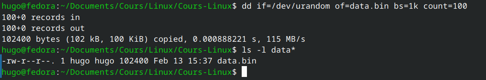

## 2. Encodage
- La commande `openssl base64 -e -in data.bin -out data.b64` va encrypter un fichier sur la base64 et l'exporter dans un nouveau : data.bin -> data.b64	
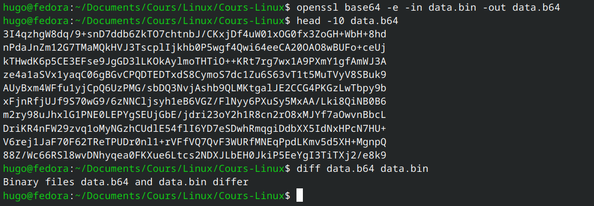
- La commande suivante va compter le pourcentage de différence entre les 2 fichiers data.bin et data.b64 : 
```bash
differ=$(cmp -l data.bin data.b64 2>/dev/null | wc -l)
total=$(stat -c %s data.bin)
echo "scale=2; $differ*100/$total" | bc
```
- Il y a donc 99,63% de différence donc seulement 0,37% de similitude 

## 3. Décodage
- La commande `openssl base64 -d -in data.b64 -out data_recovered.bin` fera l'effet inverse est decryptera le fichier data.b64 vers un nouveau : data_recovered.bin
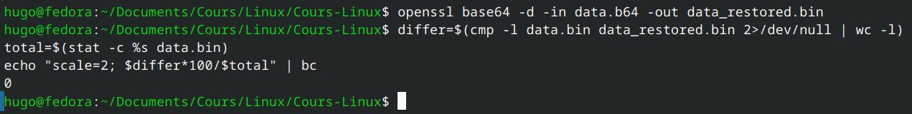

```bash
differ=$(cmp -l data.bin data_recovered.bin 2>/dev/null | wc -l)
total=$(stat -c %s data.bin)
echo "scale=2; $differ*100/$total" | bc
```
- 0% de différence entre les 2 fichiers, ils sont donc parfaitement identiques

## 4. Questions
#### 1. Base64 est-il un chiffrement ? Pourquoi ?
- Non base64 est un codage car il ne nécessite pas de clé de décryptage.
#### 2. Pourquoi la taille du fichier change-t-elle après encodage ?
- La taille du fichier change car on remplace des données binaires compactes par des système d'encodage plus longue par exemple 3 octects en base64 aura maintenant 4 octects.

#### 3. Quel est approximativement le pourcentage d’augmentation ?
- en base64 l'augmentation sera donc de 4/3 = 1.33 = 33% d'augmentation 

#### 4. Quelle méthode permet de vérifier rigoureusement que deux fichiers sont identiques ?
- La commande `diff <fichier1> <fichier2> vérifiera la différence entre ces 2 fichiers`

# B. Chiffrement symétrique – AES
## 1. Création d’un message
- Voici mon fichier confidentiel.txt :
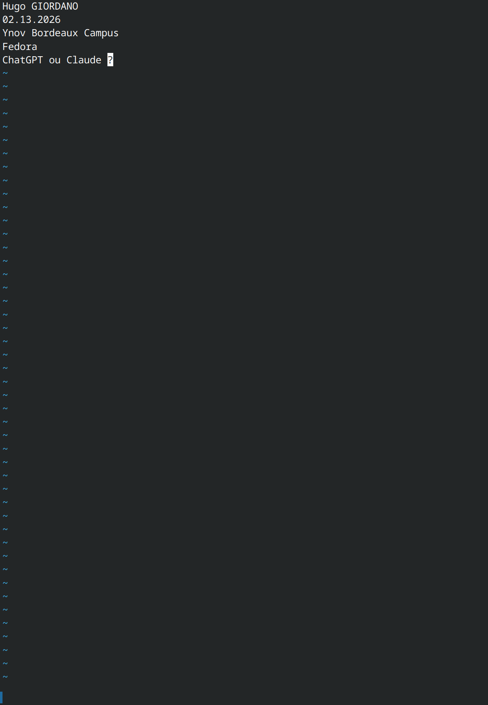
## 2. Chiffrement
- La commande `openssl enc -aes-256-cbc -salt -pbkdf2 -md sha256 -in confidentiel.txt -out confidentiel.enc` encrype mon fichier confidentiel.txt avec - le système aes256-cbc grâce au hashage sha256, utilisation de PBKDF2 pour dériver la clé depuis le mot de passe et salt pour ajouter un sel
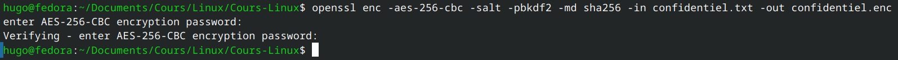

## 3. Déchiffrement
- La commande `openssl enc -d -aes-256-cbc -pbkdf2 -md sha256 -in confidentiel.enc -out confidentiel_dechiffre.txt` fera l'effet inverse est va déchiffrer le contenu du fichier confidentiel.enc
- Les fichiers confidentiel.txt et le fichier dechiffrer confidentiel_dechiffre.txt ont 0% de différence donc exactement identique
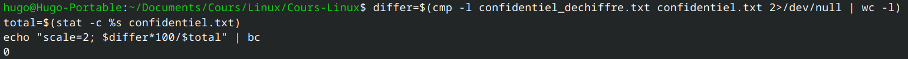

## 4. Analyse
- Après avoir recréer un fichier encrypter et tester leur différence qui s'élève à 91.66% de différence j'en conclue que 2 fichiers identique encrypter seront différents
```bash
openssl enc -aes-256-cbc -salt -pbkdf2 -md sha256 -in confidentiel.txt -out confidentiel2.enc
differ=$(cmp -l confidentiel.enc confidentiel2.enc 2>/dev/null | wc -l)
total=$(stat -c %s confidentiel2.enc)
echo "scale=2; $differ*100/$total" | bc
: 91.66%
```

## 5. Questions
#### 1. Pourquoi les deux fichiers chiffrés sont-ils différents ?
- Car l'option -salt ajoute un sel aléatoire dans l'encryption 
#### 2. Quel est le rôle du sel ?
- Le sel est utilisé dans une fonction de dérivation de clé qui utilisera :
	+ Le mot de passe
	+ Le sel
	+ Le nombre d'itération
	+ SHA-256
#### 3. Que se passe-t-il si une option change lors du déchiffrement ?
- Un message "bad decrypt" s'affiche
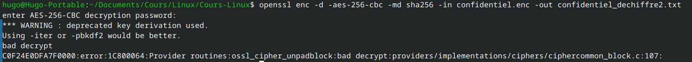

#### 4. Pourquoi utilise-t-on PBKDF2 ?
- PBKDF2 est utilisé pour créer une clé cryptographique robuste à partir du mot de passe grâce à un grand nombre d'itération prédéfini.

#### 5. Quelle est la différence entre encodage et chiffrement ?
- Le chiffrement possède une clé de décryptage ce qui permet de protéger un fichier contrairement à l'encodage qui est utilisé pour la compatibilité comme par exemple UTF-8.

# C. Cryptographie asymétrique – RSA
## 1. Génération de clés
```bash
openssl genrsa -aes-256-cbc -out rsa_private.pem 2048
openssl rsa -in rsa_private.pem -pubout -out rsa_public.pem
head rsa_private.pem
```
```bash
openssl pkey -in rsa_private.pem -text -noout
```
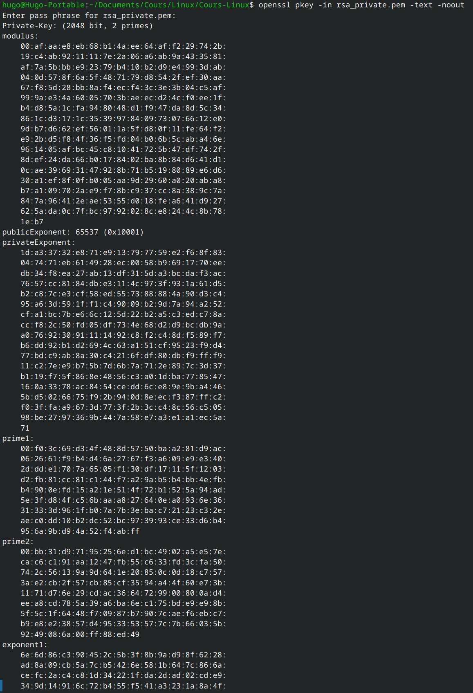

```bash
openssl pkey -pubin -in rsa_public.pem -text -noout
```
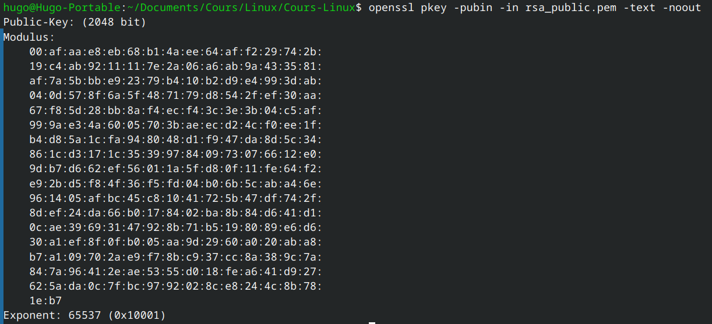

## 2. Chiffrement asymétrique
- Chiffrer le fichier secret.txt avec la clé public "rsa_public.pem" pour créer le fichier chiffré secret.enc
```bash
openssl pkeyutl -encrypt -in secret.txt -inkey rsa_public.pem -pubin -out secret.enc
```
- Déchiffrer le fichier chiffrer secret.enc à l'aide de la clé privé "rsa_private.pem" pour recréer un fichier déchiffré secret_dechiffrer.txt
```bash
openssl pkeyutl -decrypt -in secret.enc -inkey rsa_private.pem -out secret_dechiffrer.txt
```

## 3. Questions
#### 1. Pourquoi la clé privée ne doit-elle jamais être partagée ?
- Parce qu'elle permet de déchiffrer les fichiers, si elle est divulgée toute la sécurité est compromise

#### 2. Pourquoi RSA n’est-il pas adapté au chiffrement de gros fichiers ?
- Car il n'est pas conçu pour chiffrer de grandes données :
	+	Il est lent 
	+	Il est limité en taille 	(245 octects pour RSA 2048)

#### 3. Quelles différences observe-t-on entre les paramètres d’une clé publique et d’une clé privée ?
- La clé privée contient plus d'information secrète :
	+ La clé publique : modulus (n) + exposant (e)
	+ La clé privée : n + e + exposant privé (d) + facteur premier (p, q)

#### 4. Quel est le rôle du modulo dans RSA ?
- Le modulo n = p * q, sa factorisation est difficile ce qui augmente la difficulté de la sécurité

#### 5. Pourquoi utilise-t-on souvent RSA pour chiffrer une clé AES plutôt qu’un document entier ?
- AES est rapide pour les gros fichiers.
- RSA est lent mais sécurisé pour chiffrer une petite clé 
	+ Donc on rassemble la performance avec la sécurité
	
# D. Signature numérique
## 1. Création et signature
```bash
openssl dgst -sha256 contrat.txt 
openssl dgst -sha256 -sign rsa_private.pem -out contrat.sig contrat.txt 
```
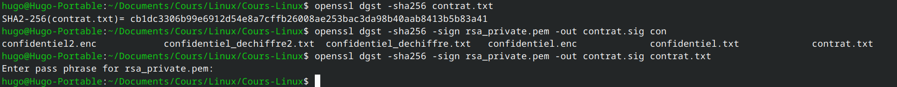

## 2. Vérification
```bash
openssl dgst -sha256 -verify rsa_public.pem -signature contrat.sig contrat.txt
```
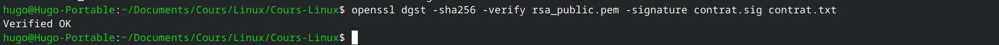

```bash
echo "Ajout d'une ligne." >> contrat.txt
openssl dgst -sha256 -verify rsa_public.pem -signature contrat.sig contrat.txt
```
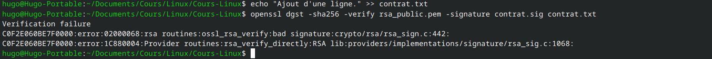

## 3. Questions
#### 1. Que se passe-t-il après modification du fichier ?
- Après la modification du fichier la signature échoue

#### 2. Pourquoi ?
- Car la signature est basé sur le hash du fichier donc si le contenu change le hash change par la même occasion 	donc la signature ne correspond plus
