# 🖥️ TP -- Administration SSH et Serveur Web Nginx

------------------------------------------------------------------------

## 👤 Étudiant

-   Nom : GIORDANO
-   Prénom : Hugo
-   Date : 19/02/2026
-   Classe : B1 - Informatique

------------------------------------------------------------------------

# 1️⃣ Mise en place de l'environnement virtualisé

## 1.3 Configuration réseau

-   Adresse IP obtenue : 192.168.122.54

### Vérification

``` bash
ip a
ping 192.168.122.54 | (Depuis le pc hôte)
```
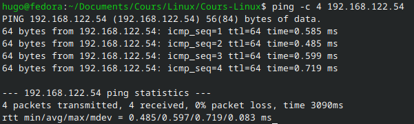


------------------------------------------------------------------------

# 2️⃣ Installation et configuration du serveur SSH

## 2.1 Installation

``` bash
sudo apt update
sudo apt install openssh-server
```

## 2.2 Vérification du service

``` bash
sudo systemctl status ssh
```

### État du service


### Vérification du port

``` bash
sudo ss -tlnp | grep 22
```
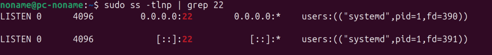

------------------------------------------------------------------------

# 3️⃣ Première connexion SSH

``` bash
ssh noname@192.168.122.54
```

### Résultat obtenu

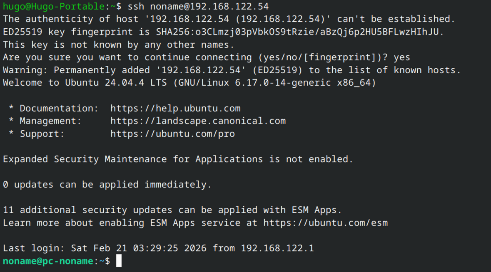

------------------------------------------------------------------------

# 4️⃣ Authentification par clé

## 4.1 Génération de clé

``` bash
ssh-keygen -t ed25519
```
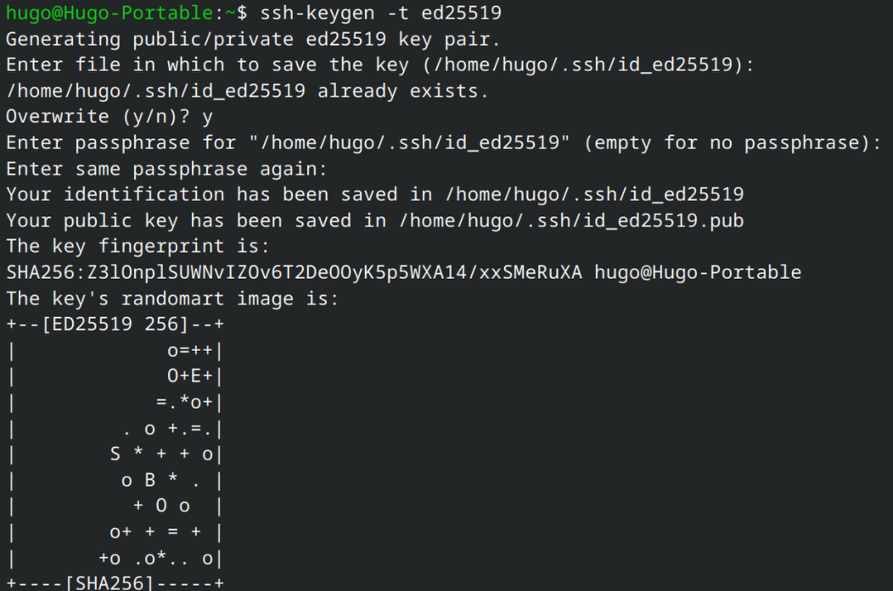

## 4.2 Copie de la clé

``` bash
ssh-copy-id noname@192.168.122.54
```
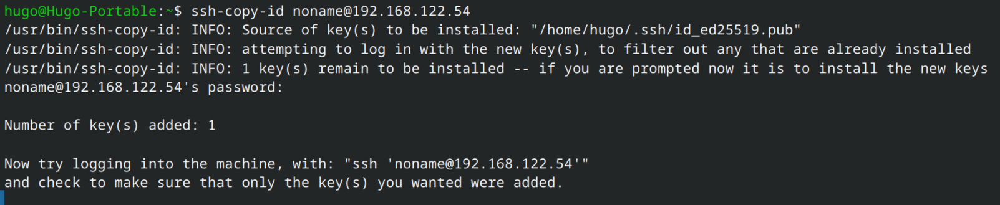

## 4.3 Test

``` bash
ssh noname@192.168.122.54
```
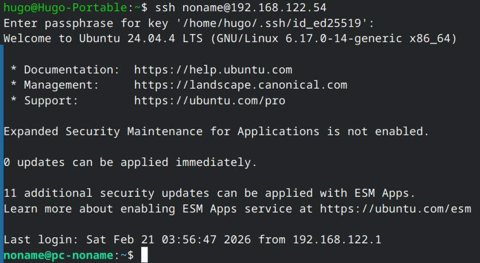

------------------------------------------------------------------------

# 5️⃣ Sécurisation du serveur SSH

Fichier modifié : \
\> /etc/ssh/sshd_config

``` bash
sudo vim /etc/ssh/sshd_config
```

### Paramètres modifiés

-   PasswordAuthentication : no
-   PermitRootLogin : no
-   Port : 2222
 
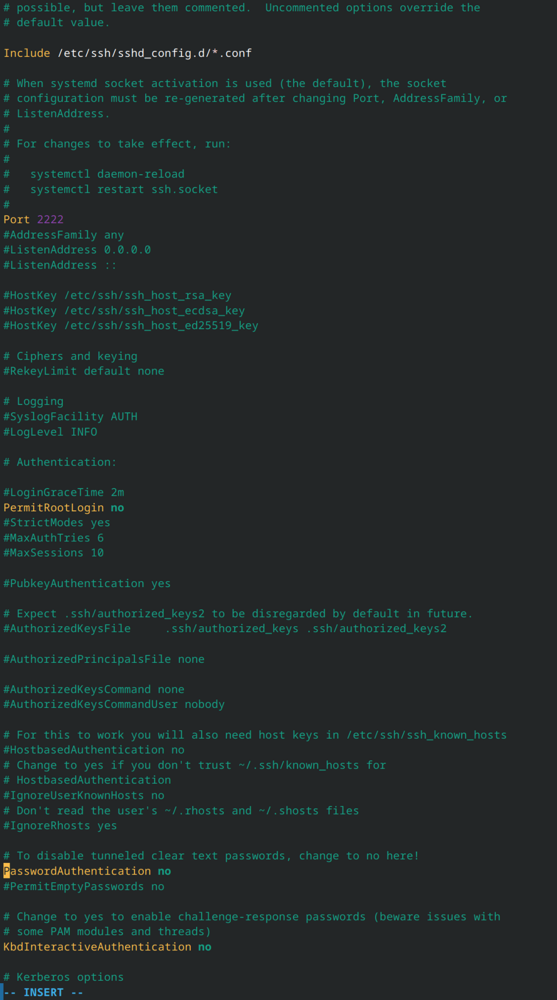

Redémarrage :

``` bash
sudo systemctl daemon-reload
sudo systemctl restart ssh.socket
sudo systemctl restart ssh
```
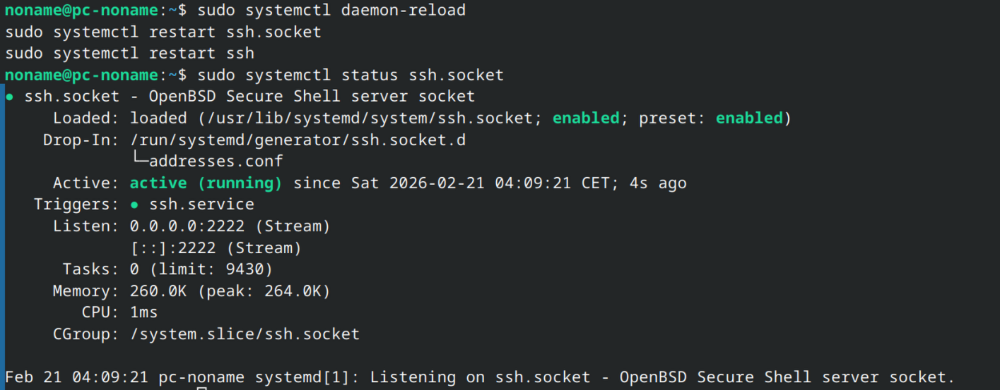

Test :

``` bash
ssh -p 2222 noname@192.168.122.54
```
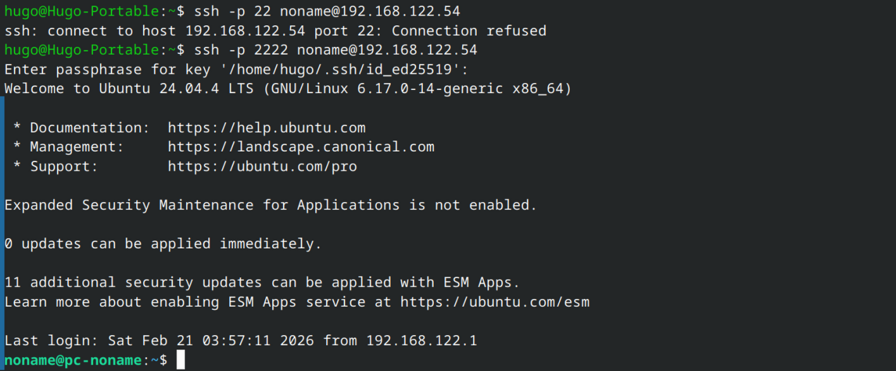

------------------------------------------------------------------------

# 6️⃣ Alias SSH

Fichier : `~/.ssh/config`

``` bash
sudo vim ~/.ssh/config
sudo chmod 700 ~/.ssh
sudo chmod 600 ~/.ssh/config
```

Test :

``` bash
ssh tpserver
```
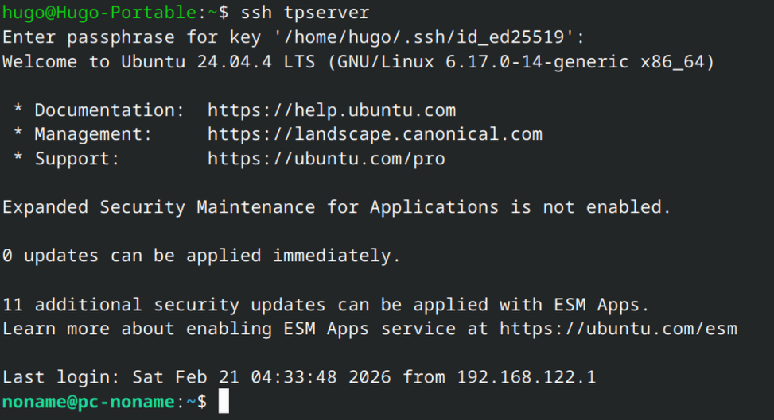


------------------------------------------------------------------------

# 7️⃣ Transfert de fichiers

## SCP

``` bash
touch fichier.txt
mkdir dossier
scp fichier.txt tpserver:/home/noname/
scp -r dossier/ tpserver:/home/noname/
```
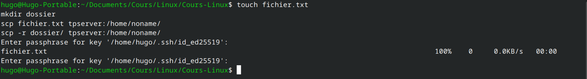

## SFTP

``` bash
sftp tpserver
put fichier.txt
get fichier.txt
ls
exit
```
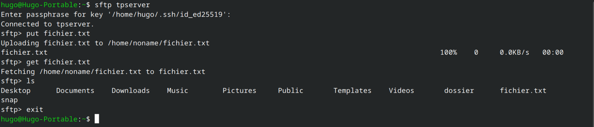

## RSYNC

``` bash
rsync -avz dossier/ tpserver:/home/noname/dossier/
```
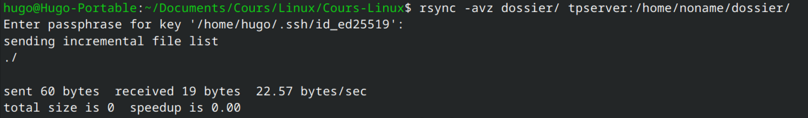

------------------------------------------------------------------------

# 8️⃣ Analyse des logs

``` bash
sudo tail -f /var/log/auth.log
```
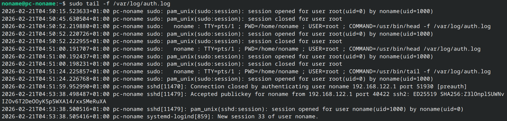

### Observations

-   Connexion réussie : 2026-02-21T04:53:38.498487+01:00 pc-noname sshd[11479]: Accepted publickey for noname from 192.168.122.1 port 40422 ssh2: ED25519 SHA256:Z3lOnplSUWNvIZOv6T2DeOOyK5p5WXA14/xxSMeRuXA \
2026-02-21T04:53:38.500516+01:00 pc-noname sshd[11479]: pam_unix(sshd:session): session opened for user noname(uid=1000) by noname(uid=0) \
2026-02-21T04:53:38.505416+01:00 pc-noname systemd-logind[859]: New session 33 of user noname.

-   Tentative échouée : 2026-02-21T04:51:59.952990+01:00 pc-noname sshd[11470]: Connection closed by authenticating user noname 192.168.122.1 port 51930 [preauth]

------------------------------------------------------------------------

# 9️⃣ Installation de Fail2Ban

``` bash
sudo apt install fail2ban
sudo systemctl status fail2ban
sudo fail2ban-client status sshd
```

Vérification :

``` bash
ssh -o PreferredAuthentications=password -o PubkeyAuthentication=no -p 2222 noname@192.168.122.54
```
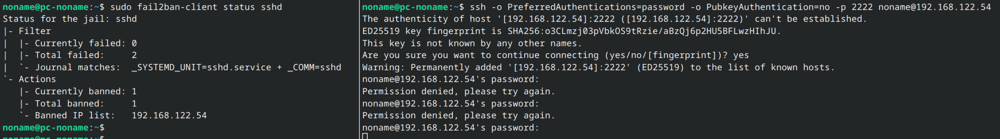

------------------------------------------------------------------------

# 🔟 Tunnel SSH

## Tunnel local

``` bash
ssh -L 8080:localhost:80 tpserver
```

## Tunnel distant

``` bash
ssh -R 9090:localhost:22 tpserver
```

------------------------------------------------------------------------

# 1️⃣1️⃣ Installation et configuration Nginx

## Installation

``` bash
sudo apt update
sudo apt install nginx
sudo systemctl status nginx
```

## Création du site

``` bash
mkdir -p /var/www/site-tp
vim /var/www/site-tp/index.html
```

### Contenu du index.html

``` html
<h1>Bienvenue sur le site TP Nginx !</h1>
```

## Configuration Nginx

``` nginx
sudo vim /etc/nginx/sites-available/site-tp

server {
    listen 80;
    server_name localhost;
    root /var/www/site-tp;
    index index.html;
}
```

Activation :

``` bash
sudo ln -s /etc/nginx/sites-available/site-tp /etc/nginx/sites-enabled/
sudo nginx -t
sudo systemctl restart nginx
```


------------------------------------------------------------------------

# 1️⃣2️⃣ HTTPS -- Certificat auto-signé

## Génération

``` bash
sudo mkdir -p /etc/nginx/ssl
cd /etc/nginx/ssl
sudo openssl req -x509 -nodes -days 365 -newkey rsa:2048 -keyout site-tp.key -out site-tp.crt
```

## Redirection HTTP → HTTPS

``` nginx
server {
    listen 443 ssl;
    server_name localhost;

    ssl_certificate /etc/nginx/ssl/site-tp.crt;
    ssl_certificate_key /etc/nginx/ssl/site-tp.key;

    root /var/www/site-tp;
    index index.html;
}

server {
    listen 80;
    server_name localhost;
    return 301 https://$host$request_uri;
}
```

Test :

``` bash
curl -k https://192.168.122.54
```
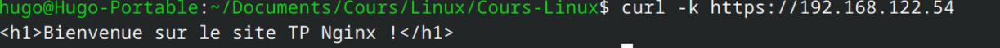

------------------------------------------------------------------------

# 1️⃣3️⃣ Firewall et permissions

``` bash
sudo ufw allow 'Nginx Full'
sudo ufw status
```
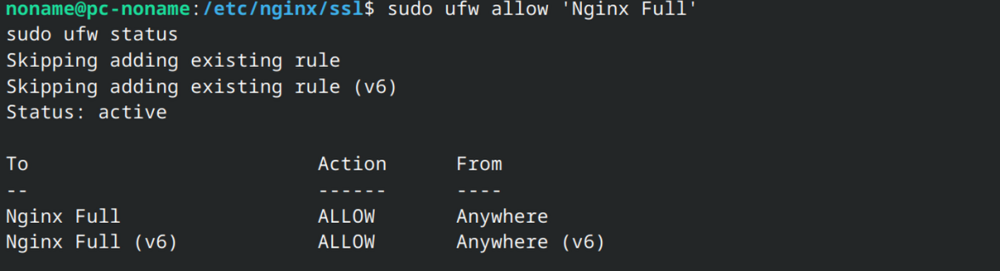

### Permissions

``` bash
sudo chown -R www-data:www-data /var/www/site-tp & sudo chmod -R 755 /var/www/site-tp
```