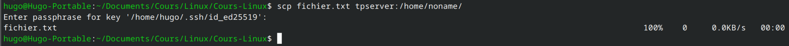
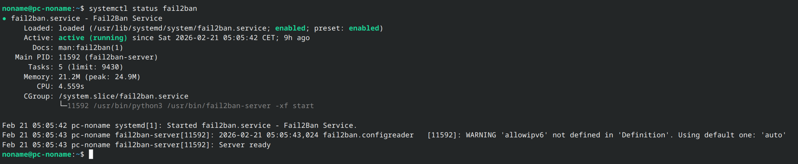
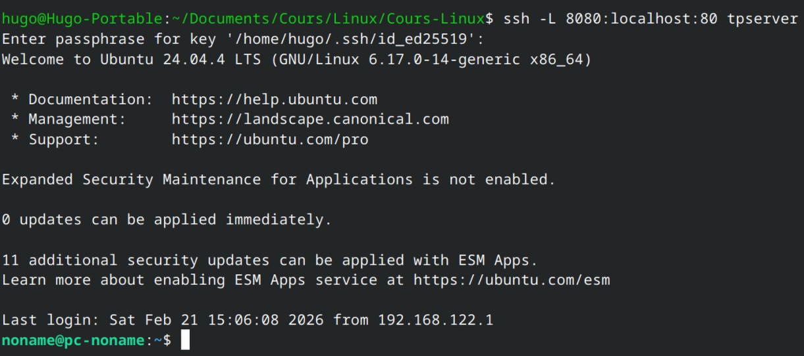
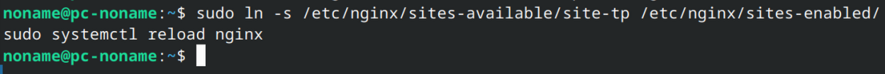
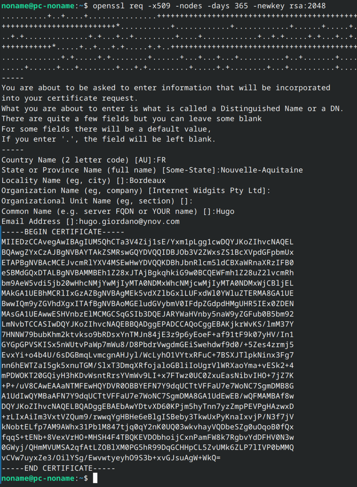
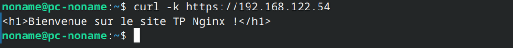
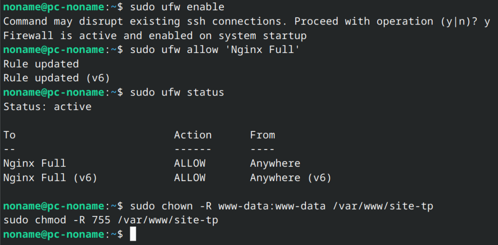

# 📘 TP – Administration SSH et Serveur Web Nginx

---

# 🎯 Objectifs

---

# 🖥️ Partie 1 – Mise en place de l’environnement virtualisé

## 1. Création de la VM

- Configuration RAM : 5Go
- Configuration disque : 50Go
- Mode réseau : NAT
- Version Ubuntu : 24.04

## 2. Vérification réseau

Commande utilisée :
```bash 
ip a
```

Adresse IP obtenue :
```
192.168.122.54
```

Test depuis la machine hôte :
```
ping -c 4 192.168.122.54
```

Résultat :


---

# 🔐 Partie 2 – Serveur SSH

## 1. Installation

Commande :
```
sudo apt install openssh-server
```

Résultat :


## 2. Vérification du service

Commande :
```
systemctl status ssh
```

État du service : active (running)

Port d’écoute : 22

## 3. Connexion depuis la machine cliente

Commande :
```
ssh noname@192.168.122.54
```

Résultat :


## 4. Génération et déploiement de clé SSH

Commande génération :
```
ssh-keygen -t ed25519
```

Commande copie clé :
```
ssh-copy-id noname@192.168.122.54
```

Résultat :


---

# 🛡️ Partie 3 – Sécurisation SSH

## 1. Modification du fichier sshd_config

Fichier :
``/etc/ssh/sshd_config``

Modifications effectuées :

- PermitRootLogin : no
- PasswordAuthentication : no
- Port personnalisé : 2222

## 2. Redémarrage du service

Commande :
```
sudo systemctl daemon-reload
sudo systemctl restart ssh.socket
sudo systemctl restart ssh
```

## 3. Test de connexion avec nouveau port

Commande :
```
ssh -p 2222 noname@192.168.122.54
```

Résultat :


## 4. Configuration alias SSH

Fichier :
``~/.ssh/config``

Contenu :
```
Host tpserver
        HostName 192.168.122.54
        User noname
        Port 2222
```
Résultat :


---

# 📁 Partie 4 – Transfert de fichiers

## 1. SCP

Commande :
``scp fichier.txt tpserver:/home/noname/``

Résultat :


## 2. SFTP

Commande :
```
sftp tpserver
```

Commandes testées :
- put : fichier.txt
- get : fichier.txt

Résultat :


## 3. RSYNC

Commande :
```
rsync -avz dossier/ tpserver:/home/noname/dossier/
```

Résultat :


---

# 🔎 Partie 5 – Analyse des logs et sécurité

## 1. Surveillance des logs SSH

Commande :
```
sudo tail -f /var/log/auth.log
```

Observations :\
\> On peut voir les dernières logs d'authentification en direct comme les :
- Connexions réussis : 2026-02-21T04:53:38.498487+01:00 pc-noname sshd[11479]: Accepted publickey for noname from 192.168.122.1 port 40422 ssh2: ED25519 SHA256:Z3lOnplSUWNvIZOv6T2DeOOyK5p5WXA14/xxSMeRuXA \
2026-02-21T04:53:38.500516+01:00 pc-noname sshd[11479]: pam_unix(sshd:session): session opened for user noname(uid=1000) by noname(uid=0) \
2026-02-21T04:53:38.505416+01:00 pc-noname systemd-logind[859]: New session 33 of user noname.

- Tentatives échouées : 2026-02-21T04:51:59.952990+01:00 pc-noname sshd[11470]: Connection closed by authenticating user noname 192.168.122.1 port 51930 [preauth]


## 2. Installation Fail2Ban

Commande :
```
sudo apt install fail2ban
```

Statut :
```
systemctl status fail2ban
```

Résultat :


---

# 🔄 Partie 6 – Tunnel SSH

## 1. Tunnel local

Commande :
```
ssh -L 8080:localhost:80 tpserver
```

Résultat :


## 2. Tunnel distant

Commande :
```
ssh -L 8080:localhost:80 tpserver
```

Résultat :


---

# 🌐 Partie 7 – Nginx et HTTPS

## 1. Installation Nginx

Commande :
```
sudo apt install nginx
```

Statut :
```
systemctl status nginx
```

## 2. Création du site

Dossier :
``/var/www/site-tp``

Contenu index.html :/
```html
<h1>Bienvenue sur le site TP Nginx !</h1>
```

## 3. Configuration HTTP

Fichier configuration :

Commande activation :
```
sudo ln -s /etc/nginx/sites-available/site-tp /etc/nginx/sites-enabled/
sudo systemctl reload nginx
```

Résultat :


## 4. Génération certificat auto-signé

Commande :
```
openssl req -x509 -nodes -days 365 -newkey rsa:2048
```


## 5. Configuration HTTPS et redirection

Bloc serveur HTTPS :

Redirection HTTP → HTTPS :
```nginx
server {
    listen 443 ssl;
    server_name localhost;

    ssl_certificate /etc/nginx/ssl/site-tp.crt;
    ssl_certificate_key /etc/nginx/ssl/site-tp.key;

    root /var/www/site-tp;
    index index.html;
}

server {
    listen 80;
    server_name localhost;
    return 301 https://$host$request_uri;
}
```

Test :
```
curl -k https://192.168.122.54
```

Résultat :


---

# 🔥 Partie 8 – Firewall et permissions

## 1. Activation UFW

Commande :
```
sudo ufw enable
```

## 2. Autorisation Nginx

Commande :
```
sudo ufw allow 'Nginx Full'
```

Statut :
```
sudo ufw status
```

## 3. Permissions

Commandes :
```
sudo chown -R www-data:www-data /var/www/site-tp
sudo chmod -R 755 /var/www/site-tp
```

Résultat :


---